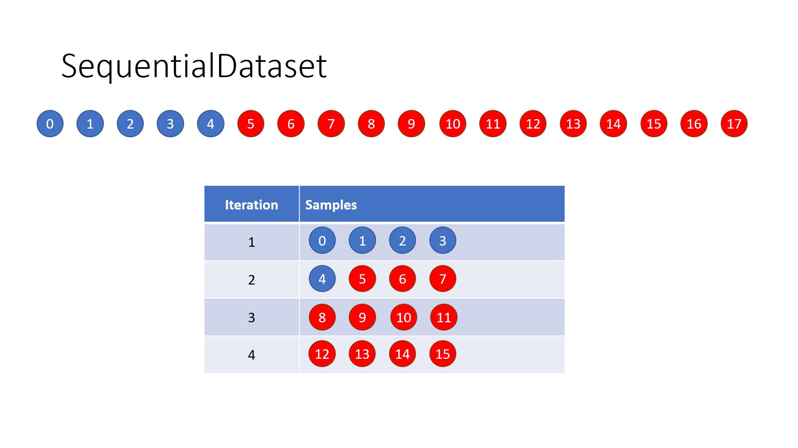
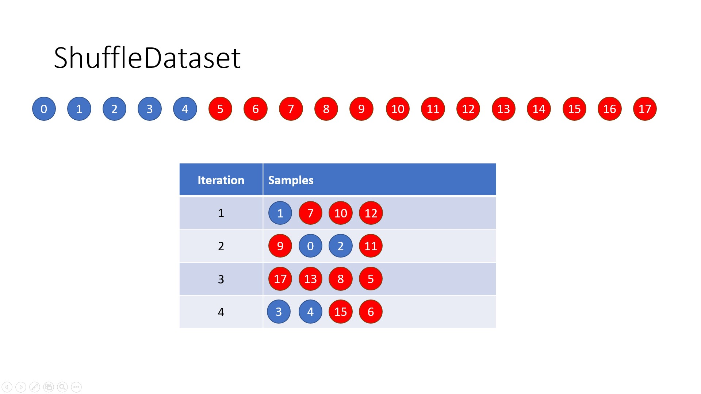
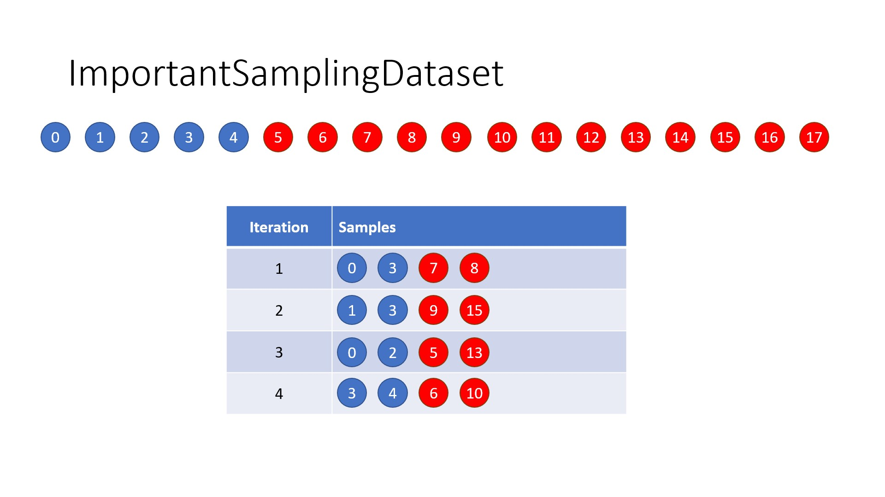

## handler.py
### Introduction

---
Implementing the pipeline between the data and model, including the sampling method and data normalization.

### Instruction

---
The complete example of using this object is shown in `method_svm.py`.

For the user of this class object, it is understandable in the below code block:
```python
from handler import *
# Construct a class object which corresponds to the sampling method
# the class object accepts two parameters:
# file: the path of the CSV file
# sep: the symbol of separator
dataset = ImportantSamplingDataset('./Data/train.csv', sep='|')

epoch = 10          # Epochs
batch_size = 4      # Batch size

# When ImportantSampling is applied, there will be a infinite loops
# because every sample can be drawn repeatedly.
# Therefore, the termination must be set with maximal number of loops.
# Ignores it if SequentialDataset or ShuffleDataset is used.
max_iter = 100

for e in range(epochs):
   for x, y in dataset.get(batch_size, max_iter=max_iter):
      print(x.shape)    # (4, 8)
      print(y.shape)    # (4,)
      print(y)          # [1 1 0 0]
```

For the developer, all the subset must inherit `ParentDataset` and implement the method `sampling()`.

Here is a standard scheme:
```python
# 1. Inherit ParentDataset
# There are two parent variables which are important
# a. self.data - pd.DataFrame: the raw data which loaded from CSV file
# b. self.rows - int: the total number of data rows
class ExampleSamplingDataset(ParentDataset):
    def __init__(self, file: str, sep: str = '|'):
        super().__init__(file, sep)
    
    # 2. Implement sampling method, must **yield** the indices of data rows (np.array)
    def sampling(self, n: int, max_iter: int):
        yield ...
```
### Explanation

---
There are several sampling methods implemented. Beginning from here, all the sampling methods will be explained visually, so there is the guide about the illustrations:
1. The **blue** ball states for the sample is labeled as fraud while the **reds** do not.
2. The number of batch size are set as **4**, which means **4** samples will be trained in each iteration (NOT epoch).
3. The number on the balls refers to the index of sample in the pool.

Let's begin to explain the sampling methods:
1. SequentialDataset 
   
   All the samples will be drawn sequentially. _Every sample will be only drawn once._
   
   
2. ShuffleDataset
   
    All the samples will be drawn randomly. _Every sample will be only drawn once._
   
   
3. ImportantSamplingDataset 
   
   Due to the imbalance situation, the **red** balls will always be drawn with high probability. To deal with this dilemma, **the balls with different color** could be seperated in distinct groups and drew **half amount of batch size** (in this case, 4/2=2) from each group.
   
   _Every sample can be repeatedly drawn._
   